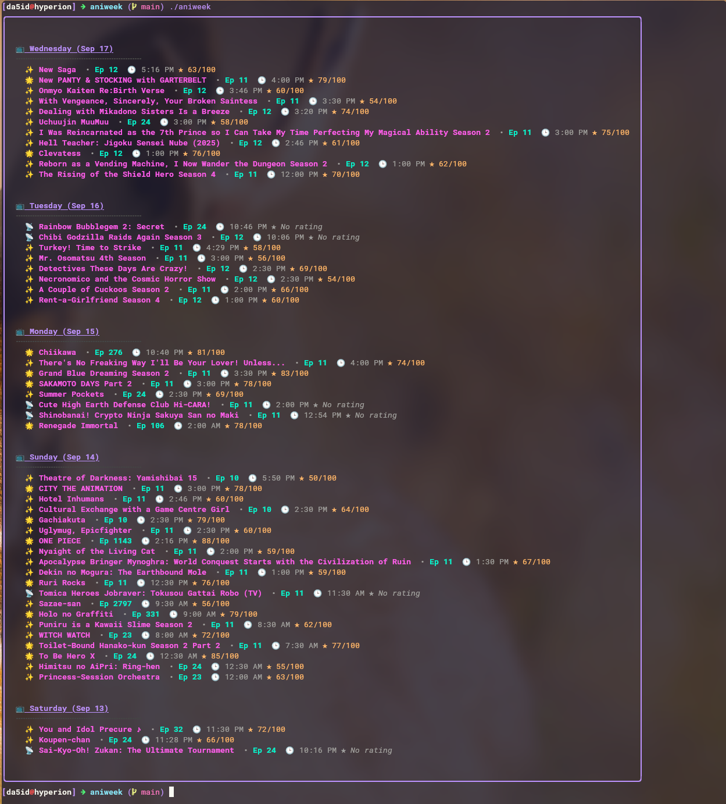

# AniWeek

AniWeek is a lightweight program that lists all the anime episodes that aired in the last week. It's designed for anime fans who want a quick overview of recent releases without digging through multiple sites.

## Features

Displays anime that aired in the last week.

Can output in a simple list format for quick reference.

Lightweight and fast, suitable for CLI or integration into other scripts.

## Build instructions 
```
# Clone the repo
git clone https://github.com/yourusername/aniweek.git
cd aniweek

# Build AniWeek
go build -o aniweek
./aniweek
```

## Run AniWeek to see the last week's anime
```
# Add to your system
cp aniweek ~/.local/bin/
aniweek
```

## Sample output:




## Contributing

Contributions are welcome! Feel free to submit issues or pull requests to improve AniWeek.
